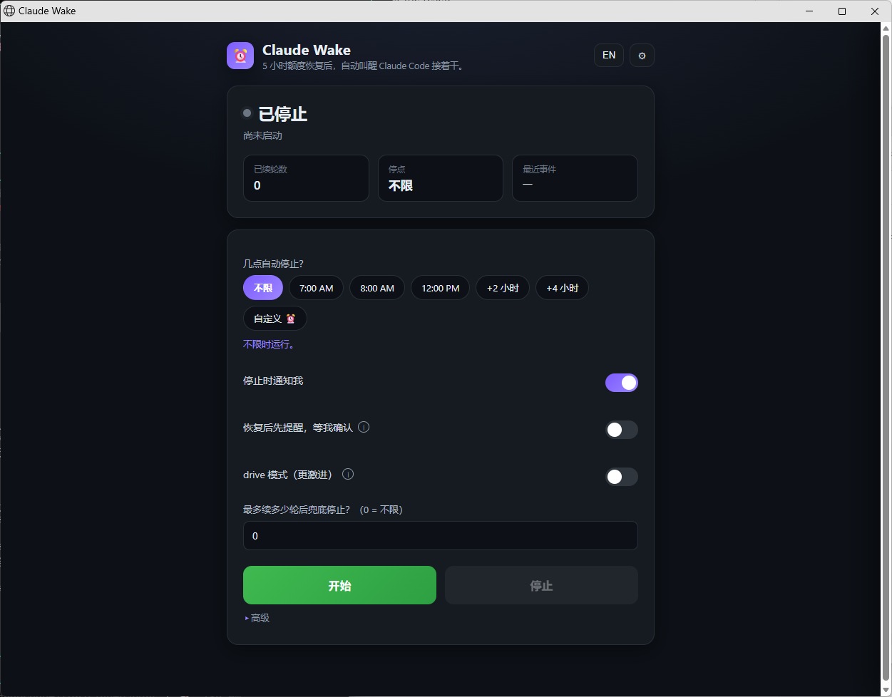

English | [中文](README.zh.md)

# Claude Wake

**Auto-resume Claude Code after the 5-hour usage limit resets.**

When your interactive Claude Code session hits the 5-hour usage limit, Claude Wake
reads the reset time from the session transcript, sleeps until that moment, and
injects `continue` into your tmux session so Claude picks up where it left off.
It stops (and notifies you) when it reaches one of three boundaries.

It is a tiny local tool: **pure Python standard library + tmux, nothing to install.**
The backend binds to `127.0.0.1` only and never reads your Claude credentials.



---

## How it works

```
watch newest transcript (~/.claude/projects/<encoded work_dir>/*.jsonl)
      |
      v
parse the reset time
   - preferred: "usage limit reached|<unix epoch>"   (exact)
   - fallback : "resets 3pm" / "resets 1:40am"        (human-readable, local tz)
      |
      v
sleep until reset (+ buffer), with a live countdown in the dashboard
      |
      v
tmux send-keys "continue"  ->  Claude resumes
```

A single Python web backend plus one watchdog thread; no external dependencies.
Injection happens in your one live tmux session, so there is never a conflict.

### Three stop boundaries

1. **Done marker** -- Claude outputs `ALL_DONE` in its reply (checked only inside
   assistant replies, so the instruction echoing it cannot trigger a false stop).
2. **Stop time** -- you set a cutoff (e.g. `08:00`); no new round starts after it.
3. **Max rounds** -- a safety brake after N resumes (`0` = unlimited).

---

## Quick Start

### Windows + WSL2

1. Copy `config.example.json` to `config.json` and set `work_dir` / `tmux_session`
   (or just run once -- a default `config.json` is generated automatically).
2. **Double-click `start.bat`.** It opens three things:
   - a backend window (**closing it stops the tool**),
   - the dashboard (Edge app-mode if available, otherwise your default browser),
   - a terminal running Claude inside tmux.
3. Dispatch work in the Claude terminal, then in the dashboard pick a **stop time**
   and click **Start**. Go to sleep; it resumes Claude when the quota resets.

### Linux / macOS

```bash
cp config.example.json config.json   # then edit work_dir / tmux_session
./start.sh                           # starts backend + opens the dashboard
# in another terminal, run Claude inside tmux:
tmux new -A -s claude-work claude
```

---

## Configuration

All settings live in `config.json` (gitignored). You can edit them in the
dashboard's **Settings** drawer -- no hand-editing required.

| Key | Meaning |
|-----|---------|
| `port` | Dashboard port (default `8770`). Changing it needs a backend restart. |
| `tmux_session` | Name of the tmux session running Claude (default `claude-work`). |
| `work_dir` | Claude's working directory, used to locate the transcript. Empty = scan all projects, newest wins. |
| `claude_launch_args` | Extra args appended to `claude` when launched by `start_claude.sh`. |
| `continue_text` | The text injected after the reset. |
| `done_marker` | Completion marker (default `ALL_DONE`). |
| `poll_sec` | Polling interval in seconds (default `30`). |
| `buffer_sec` | Extra seconds to wait past the reset moment (default `60`). |
| `default_until` | Default value of the dashboard "stop at" control. |
| `default_max_rounds` | Default max rounds (`0` = unlimited). |
| `lang` | Notification language: `en` or `zh`. |

---

## Notifications

Claude Wake notifies you when it stops (and when the quota is restored, if you enable
the confirm window). It picks the first channel that works on your system:

1. **Windows toast** -- shown via `powershell.exe` (works from inside WSL; this is
   the default path on Windows + WSL2).
2. **Linux desktop** -- `notify-send`.
3. **macOS** -- `osascript` notification.

Use the **Advanced -> Test: send a notification** button to verify the path.

### "Remind me first" confirm window

If you enable **"Remind me first, wait before continuing"**, then when the quota is
restored Claude Wake does not continue immediately. Instead it sends a notification
and waits N minutes (your choice). In the dashboard you can then:

- **Continue now** -- inject "continue" immediately;
- **Stop, I'll take over** -- stop Claude Wake and resume the work yourself;
- **do nothing** -- it continues automatically when the countdown ends.

This turns Claude Wake into a pure reminder when you happen to be at your desk,
while still working unattended when you are not.

---

## Security

- The backend binds to **`127.0.0.1` only** -- not reachable from the network.
- It **never reads your Claude credentials**; it only reads transcript text and the
  tmux pane to detect the limit and the reset time.
- It makes **no network requests** of its own; everything stays on your machine.

---

## Limitations

- Relies on the Claude CLI transcript / on-screen message format. If a future CLI
  version changes the wording, the reset-time regex may need an update.
- Your PC and WSL must **stay awake** overnight -- do not `wsl --shutdown`, suspend,
  or power off, or the background process stops.
- Requires **tmux** (Claude must run inside a tmux session so `send-keys` can reach it).

---

## FAQ

**Why must Claude run inside tmux?**
Claude Wake injects "continue" with `tmux send-keys`. tmux gives a stable, named
session to target; without it there is no reliable way to type into your live session.

**My conversation hit the limit in a normal terminal (not tmux). How do I hand it over?**
Close that terminal first (two processes must not share one conversation), then
double-click `start.bat`. Set `claude_launch_args` to `--continue` (in the dashboard
Settings) and the Claude terminal will automatically resume the **most recent
conversation in your `work_dir`** -- exactly the one that hit the limit. Use
`--resume` instead if you want a picker of recent conversations.

**The dashboard says "No interactive session found".**
Claude is not running inside tmux. Run `tmux new -A -s claude-work claude` (or
double-click `start.bat`).

**Start does nothing / the page will not load.**
Make sure the backend window is still open, and that the `port` is not already in use.

**It did not resume at the reset time.**
Check `logs/run-*.log`; it records the reset time it parsed. The most likely cause
is a transcript wording the regex did not match.

**What is "drive" mode?**
Off by default. When on, it re-sends "continue" after each natural turn end (not just
on a limit hit) to push multiple rounds autonomously. It uses more quota and only
stops on `ALL_DONE`. For overnight limit-bridging you do not need it.

---

## License

MIT -- see [LICENSE](LICENSE).
